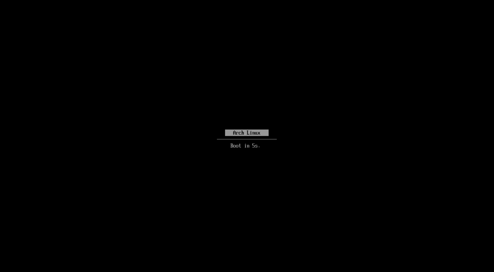

# systemd-boot GRUB theme

A GRUB theme that looks like the systemd-boot menu.



## Files

| File | Purpose |
| --- | --- |
| `theme.txt` | The GRUB theme definition |
| `efi-firmware-19.pf2` | The EDK2/OVMF firmware font, the one systemd-boot draws with |
| `line.png` | The divider under the menu |
| `select_c.png` | The highlight bar behind the selected entry |
| `install.sh` | Installs the theme and configures GRUB |
| `center-entries.sh` | Regenerates `grub.cfg`, then centres titles and sizes the menu |
| `LICENSE-efi-font.txt` | Licence for the font (BSD-2-Clause-Patent) |

## Installation

The install script uses Arch Linux paths (`/boot/grub`, `/etc/default/grub`).

```sh
sudo ./install.sh
```

It does the following:

1. Copies the theme into `/boot/grub/themes/systemd-boot/`, along with GRUB's
   `unicode.pf2` as a fallback font. If a `theme.txt` is already there, it is
   saved as `theme.txt.bak`.
2. Backs up `/etc/default/grub` to `/etc/default/grub.bak` the first time only,
   so the backup always holds your original config.
3. Sets `GRUB_THEME` and `GRUB_TERMINAL_OUTPUT="gfxterm"` and leaves every
   other setting alone.
4. Installs `center-entries.sh` as `/usr/local/bin/grub-mkconfig-sdboot` and
   runs it.

Running it again is safe and updates an existing install.

## Regenerating the config

After installing, use this instead of `grub-mkconfig`:

```sh
sudo grub-mkconfig-sdboot
```

GRUB can't centre or auto-size a menu by itself, so the script runs
`grub-mkconfig -o /boot/grub/grub.cfg` and then edits the result:

- Removes the "Advanced options" submenus.
- Removes the `Loading Linux ...` / `Loading initial ramdisk ...` messages.
- Centres each title by padding it with leading spaces.
- Resizes the menu box in `theme.txt` the way systemd-boot does. The box is as
  wide as the longest title plus 3 characters on each side, and one row tall
  per entry. The divider and countdown sit right below it.

The "UEFI Firmware Settings" entry only counts towards the menu size when the
firmware supports it.

> [!NOTE]
> Running plain `grub-mkconfig` (for example from a package hook) overwrites
> those edits. The menu then shows uncentred titles in a box sized for the old
> entries. Run `grub-mkconfig-sdboot` again to fix it.

### Options

```sh
grub-mkconfig-sdboot [--no-mkconfig] [grub.cfg] [theme.txt]
```

- `--no-mkconfig` edits the existing `grub.cfg` without regenerating it.
- `grub.cfg` defaults to `/boot/grub/grub.cfg`.
- `theme.txt` defaults to `/boot/grub/themes/systemd-boot/theme.txt`.

To change the behaviour, edit these variables at the top of the script:

| Variable | Default | Effect |
| --- | --- | --- |
| `HIDE_ADVANCED` | `yes` | Set to `no` to keep the "Advanced options" submenus |
| `HIDE_LOADING` | `yes` | Set to `no` to keep the `Loading ...` messages |
| `MAX_ROWS` | `12` | Above this many entries, the menu scrolls |
| `MAX_COLS` | `80` | Maximum width of the highlight bar, in characters |

Edit the installed copy in `/usr/local/bin`, or edit the repo copy and run
`install.sh` again.

## Uninstalling

```sh
sudo mv /etc/default/grub.bak /etc/default/grub
sudo rm -r /boot/grub/themes/systemd-boot /usr/local/bin/grub-mkconfig-sdboot
sudo grub-mkconfig -o /boot/grub/grub.cfg
```

## Licence

The font in `efi-firmware-19.pf2` was converted from the narrow glyph table in
EDK2 (`MdeModulePkg/Universal/Console/GraphicsConsoleDxe/LaffStd.c`). It is
© Intel Corporation and licensed under BSD-2-Clause-Patent. See
[`LICENSE-efi-font.txt`](LICENSE-efi-font.txt).
